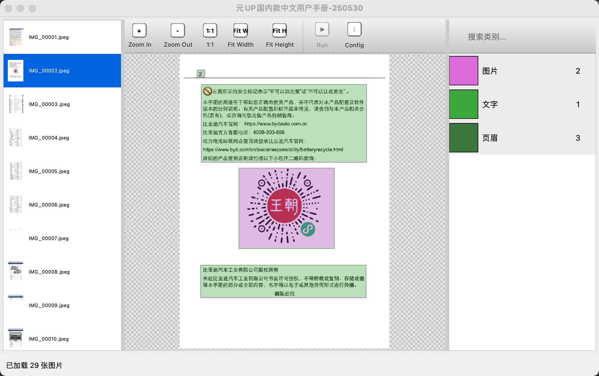

# KBoxLabel

KBoxLabel is a PyQt5-based image annotation tool designed for object detection tasks. It provides an intuitive graphical interface and supports importing and exporting annotations in multiple formats, including COCO and YOLO.

## Features

- **Graphical User Interface**: Built with PyQt5, offering an intuitive and user-friendly interface
- **Multiple Annotation Types**: Supports rectangle annotations suitable for object detection tasks
- **Multi-format Support**: Supports importing and exporting in COCO and YOLO formats
- **Auto Annotation**: Integrated with YOLOv8 model for automatic annotation capabilities
- **Cross-platform**: Supports Windows, macOS, and Linux systems
- **Keyboard Shortcuts**: Provides rich keyboard shortcuts to improve annotation efficiency
- **Database Storage**: Fully adopts SQLite3 database for storing project configurations and annotation data, replacing the original .kolo files
- **Multi-Project Support**: Supports simultaneously opening and managing multiple project windows

## Interface Preview



## Installation Guide

### System Requirements

- Python 3.11 or higher
- Supported systems: Windows, macOS, Linux

### Installation Steps

1. Clone the repository:
```bash
git clone https://github.com/your-username/KBoxLabel.git
cd KBoxLabel
```

2. Create a virtual environment (recommended):
```bash
# Using conda to create virtual environment
conda create -n kboxlabel python=3.11
conda activate kboxlabel
```

3. Install dependencies:
```bash
# Linux/macOS
bash ./app/pip_install.sh

# Windows
pip install -r app/requirements.txt
```

## Usage

### Launch the Application

```bash
python src/main.py
```

### Basic Operations

1. **Create or Open a Project**: After launching the application, select to create a new project or open an existing one
2. **Import Images**: Place image files in the project directory or use the import function
3. **Create Annotation Categories**: Add required categories in the right annotation list
4. **Perform Annotation**:
   - Select the category to annotate
   - Hold down the left mouse button and drag on the image to create a rectangle
   - Adjust the rectangle position and size by dragging the borders or corners
5. **Save Annotations**: Annotations are automatically saved to SQLite database

### Keyboard Shortcuts

- `Delete` / `Backspace`: Delete selected annotations
- `Ctrl+S`: Save annotations
- `Ctrl+Mouse Wheel`: Zoom image
- `Arrow Keys`: Fine-tune the position of selected annotations
- `Shift+Arrow Keys`: Adjust the size of selected annotations

### Annotation Management

- **Select Annotations**: Click on annotation boxes to select
- **Move Annotations**: Drag after selecting an annotation
- **Resize Annotations**: Drag the control points on edges or corners after selecting an annotation
- **Category Switching**: Select the current annotation category through the right category list

### Project Management

- **Multi-Project Support**: Can simultaneously open multiple project windows for work
- **Recent Projects**: The application remembers recently opened projects for quick access
- **Project Data Storage**: All project data (including annotation information, category configurations, etc.) is stored in SQLite database

### Import/Export

#### COCO Format

1. Select "Export" -> "Export to COCO" from the menu bar
2. Choose the export directory
3. The system will automatically convert all annotation data to COCO format

#### YOLO Format

1. Select "Export" -> "Export to YOLO" from the menu bar
2. The system will automatically convert all annotation data to YOLO format

## Auto Annotation

KBoxLabel integrates the YOLOv8 model to support automatic annotation:

1. Click the "Config" button in the toolbar to configure the model
2. Select your YOLOv8 model file (.pt format)
3. Click the "Run" button to execute automatic annotation

## Data Storage

### SQLite Database

KBoxLabel now fully uses SQLite database to store all project data, including:

- Annotation information (kolo_item table)
- Annotation categories (annotation_category table)
- Project configurations (kv_config table)

The database files are stored in the `.kboxlabel` folder within the project directory.

### Supported Image Formats

- JPEG (.jpg, .jpeg)
- PNG (.png)
- BMP (.bmp)
- Other image formats supported by PyQt5

## Development Guide

### Project Structure

```
KBoxLabel/
├── app/                 # Application configuration and dependencies
├── src/                 # Source code
│   ├── core/            # Core functionality modules
│   ├── models/          # Data models
│   ├── ui/              # User interface
│   └── main.py          # Application entry point
└── README.md            # Documentation
```

### Building the Project

To build the project structure from scratch, run:

```bash
./init_proj.sh
```

## Contributing

Issues and Pull Requests are welcome to help improve KBoxLabel.

## License

This project is licensed under the [MIT License](LICENSE).

## Contact

If you have any questions or suggestions, please contact us through:

- Submit an Issue
- Email: [kermit.mei@gmail.com]